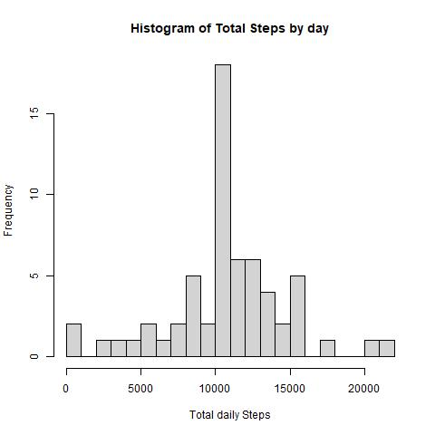
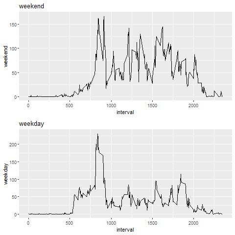

```{r setup, include=FALSE}
knitr::opts_chunk$set(echo = TRUE, fig.path='figure/')
```


### Introduction

This is the first assignment in the Coursera course "Reproducible Research", taught by the Johns Hopkins University.

By using the data and the instructions provided y the assignment's website, the basic principles  behind reproducible research will be put into action.

In order to complete the tasks, the following packages will be used:

```{r packages, echo=TRUE, message=FALSE, warning=FALSE}

library(dplyr)
library(reshape2)
library(ggplot2)
library(gridExtra)
```

### Loading and preprocessing the data

The second step includes setting the working directory to the source file location and loading the data.

```{r data loading}

setwd(dirname(rstudioapi::getActiveDocumentContext()$path))

download.file("https://d396qusza40orc.cloudfront.net/repdata%2Fdata%2Factivity.zip", destfile = "activity.zip", mode="wb")

unzip("activity.zip")
data <- read.csv("activity.csv", header = TRUE)


```

The questions provided in the assignment will be answered in the following sections.


### What is mean total number of steps taken per day?

1. Calculate the total number of steps taken per day.

```{r number steps}

databydate <- data %>% select(date, steps) %>% group_by(date) %>% summarize(tsteps= sum(steps)) %>%na.omit()

databydate

```

2. Make a histogram of the total number of steps taken each day.

```{r histogran steps}

jpeg(file="figure\\1_totalNumberStepsDaily.jpeg")

hist(databydate$tsteps, xlab = "Total daily Steps",main="Histogram of Total Steps by day", breaks = 20)

dev.off()

 

```

3. Calculate and report the mean and median of the total number of steps taken per day.

```{r mean median steps}

mean(databydate$tsteps)
median(databydate$tsteps)

```


### What is the average daily activity pattern?

1. Make a time series plot of the 5-minute interval (x-axis) and the average number of steps taken, averaged across all days (y-axis)

```{r time plot}

data_timePlot <- dcast(data, date ~ interval , value.var = "steps")

data_timePlot <- lapply(data_timePlot[2:ncol(data_timePlot)], mean, na.rm=TRUE)

data_timePlot <- data.frame(data_timePlot)

data_timePlot <- t(data_timePlot)

data_timePlot <- data.frame(cbind(unique(data$interval), data_timePlot))

colnames(data_timePlot) <- c("interval", "steps")


jpeg(file="figure\\2_averageSteps5minInterval.jpeg")

ggplot(data=data_timePlot, aes(x=interval, y=steps)) + geom_line()

dev.off()


 


```

2. Which 5-minute interval, on average across all the days in the dataset, contains the maximum number of steps?

```{r interval max steps}

data_timePlot[rev(order(data_timePlot$steps)),][1,1]


```


## Imputing missing values.


1. Calculate and report the total number of missing values in the dataset. 

```{r missing values}

sum(is.na(data$steps))

```


2. Devise a strategy for filling in all of the missing values in the dataset:

```{r flling in NA}

data_imputedNA <- dcast(data, date ~ interval , value.var = "steps")


for (column in c(2:ncol(data_imputedNA)))
{
  for (row in c(1:nrow(data_imputedNA)))
  {
    if( is.na(data_imputedNA[row, column]) ) {
      
      data_imputedNA[row, column] = lapply(data_imputedNA[column], mean, na.rm = TRUE)

    }
  }
}
```

3. Create a new dataset that is equal to the original dataset but with the missing data filled in. In this case, I have filled in the NA data with the mean for each 5 minute interval.

```{r filled dataset}


data_timePlotFilled <- melt(data_imputedNA) 

data_timePlotFilled <- data_timePlotFilled[order(data_timePlotFilled$date),]

colnames(data_timePlotFilled) <- c("date", "interval", "steps")

data_timePlotFilled <- cbind(data_timePlotFilled$steps, data_timePlotFilled[1:2])

colnames(data_timePlotFilled) <- c("steps", "date", "interval")

```


4. Make a histogram of the total number of steps taken each day and Calculate and report the mean and median total number of steps taken per day. 

```{r 4 hist, median, mean}


databydateFilled <- data_timePlotFilled %>% select(date, steps) %>% group_by(date) %>% summarize(tsteps= sum(steps)) %>%na.omit()


jpeg(file="figure\\3_totalNumberStepsDaily_Filled.jpeg")

hist(databydateFilled$tsteps, xlab = "Total daily Steps",main="Histogram of Total Steps by day", breaks = 20)

dev.off()





mean(databydateFilled$tsteps)
median(databydateFilled$tsteps)


```


## Are there differences in activity patterns between weekdays and weekends?

1. Create a new factor variable in the dataset with two levels – “weekday” and “weekend” indicating whether a given date is a weekday or weekend day.


```{r factor}

data_timePlotFilled$day <- weekdays( as.Date(data_timePlotFilled$date, format = "%Y-%m-%d") )


for( row in c(1:nrow(data_timePlotFilled)) ){
  
  if(data_timePlotFilled$day[row] %in% c("lunes","martes","miércoles","jueves", "viernes")){
    
    data_timePlotFilled$day[row] = "weekday"
    
  } else {
    
    data_timePlotFilled$day[row] = "weekend"
  
  }
}

data_timePlot_week <- dcast(data_timePlotFilled, day ~ interval , value.var = "steps", fun.aggregate = mean)

data_timePlot_week <- data.frame( t(data_timePlot_week) )

data_timePlot_week <- data_timePlot_week[2:nrow(data_timePlot_week),1:2]

data_timePlot_week <- cbind(unique(data_timePlotFilled$interval), data_timePlot_week)

colnames(data_timePlot_week) <- c("interval", "weekday", "weekend")

data_timePlot_week$interval <- unique(data$interval)

data_timePlot_week$weekday <- as.numeric(data_timePlot_week$weekday)

data_timePlot_week$weekend <- as.numeric(data_timePlot_week$weekend)

```


2. Make a panel plot containing a time series plot of the 5-minute interval (x-axis) and the average number of steps taken, averaged across all weekday days or weekend days (y-axis).


```{r panel}

p1 <- ggplot(data=data_timePlot_week, aes(x=interval, y=weekend)) + geom_line() + ggtitle("weekend")

p2 <- ggplot(data=data_timePlot_week, aes(x=interval, y=weekday)) + geom_line() + ggtitle("weekday")


jpeg(file="figure\\4_averageSteps5minInterval_week.jpeg") 

grid.arrange(p1, p2, nrow = 2) 
 
dev.off()




```


